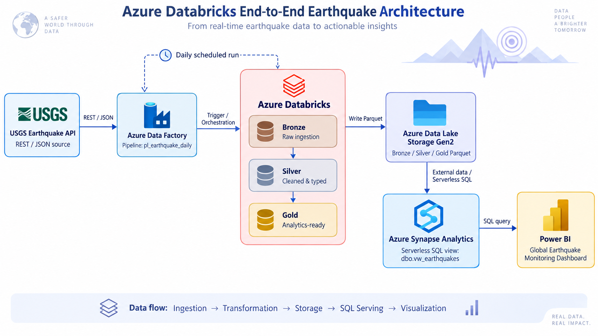

<div align="center">

#  Azure End-to-End Earthquake Lakehouse

### From real-time USGS earthquake data to analytics-ready insights with Azure

An end-to-end cloud data engineering project that ingests earthquake data from the **USGS REST API**, orchestrates processing with **Azure Data Factory**, transforms data through a **Bronze–Silver–Gold Lakehouse architecture in Azure Databricks**, stores it in **ADLS Gen2**, exposes it through **Azure Synapse Serverless SQL**, and delivers interactive analytics in **Power BI**.

<br>


</div>

---

## ✨ Project Overview

This project implements a complete **Azure data engineering pipeline** for global earthquake monitoring.

The pipeline retrieves earthquake events from the **USGS Earthquake API**, processes them through a multi-layer Lakehouse architecture, and exposes analytics-ready data to a Power BI dashboard.

The workflow is fully orchestrated and parameterized so that a scheduled Azure Data Factory pipeline can trigger the Databricks workflow automatically for a given date interval.

```text
USGS Earthquake API
        ↓
Azure Data Factory
        ↓
Azure Databricks
        ↓
Bronze → Silver → Gold
        ↓
Azure Data Lake Storage Gen2
        ↓
Azure Synapse Serverless SQL
        ↓
Power BI Dashboard
```

---

# 🏗️ Architecture



### Data Flow

```text
                    ┌───────────────────────┐
                    │ USGS Earthquake API   │
                    │ REST / JSON           │
                    └───────────┬───────────┘
                                │
                                ▼
                    ┌───────────────────────┐
                    │ Azure Data Factory    │
                    │ pl_earthquake_daily   │
                    └───────────┬───────────┘
                                │
                                ▼
                 ┌──────────────────────────────┐
                 │      Azure Databricks        │
                 │                              │
                 │  Bronze → Silver → Gold      │
                 │                              │
                 │  Raw     Clean    Analytics  │
                 └──────────────┬───────────────┘
                                │
                                ▼
                 ┌──────────────────────────────┐
                 │ Azure Data Lake Storage Gen2 │
                 │ Bronze / Silver / Gold       │
                 └──────────────┬───────────────┘
                                │
                                ▼
                 ┌──────────────────────────────┐
                 │ Azure Synapse Analytics      │
                 │ Serverless SQL               │
                 │ dbo.vw_earthquakes           │
                 └──────────────┬───────────────┘
                                │
                                ▼
                    ┌───────────────────────┐
                    │       Power BI        │
                    │ Monitoring Dashboard  │
                    └───────────────────────┘
```

---

# 🚀 Key Features

-  **REST API ingestion** from the USGS Earthquake API
-  **Azure Data Factory orchestration**
-  **Bronze–Silver–Gold Medallion Architecture**
-  Distributed transformations with **PySpark**
-  Cloud storage using **Azure Data Lake Storage Gen2**
-  Analytics-ready **Parquet datasets**
-  Secure Azure access using **Managed Identity**
-  Unity Catalog external locations and volumes
-  Parameterized Databricks workflows
-  Automated daily pipeline execution
-  **Synapse Serverless SQL** analytics layer
-  Interactive **Power BI dashboard**
-  Geographic earthquake visualization
-  Temporal, magnitude, country and significance analytics

---

# 🧱 Medallion Architecture

## 🥉 Bronze — Raw Ingestion

The Bronze layer preserves the source response from the USGS API with minimal transformation.

```text
USGS REST API
     ↓
GeoJSON
     ↓
Bronze
```

Example storage structure:

```text
bronze/
└── run_date=YYYY-MM-DD/
    └── earthquakes.geojson
```

### Responsibilities

- Retrieve earthquake data from USGS
- Preserve raw source information
- Store ingestion runs by date
- Provide traceability for downstream transformations

---

## 🥈 Silver — Cleaned & Structured

The Silver layer converts the nested GeoJSON structure into a clean analytical schema.

Typical attributes include:

```text
earthquake_id
magnitude
place
event_time
updated_time
longitude
latitude
depth_km
significance
felt
tsunami
status
magnitude_type
source
run_date
```

### Transformations

- Flatten nested GeoJSON objects
- Extract geographic coordinates
- Convert timestamps
- Cast numerical fields
- Validate coordinates
- Remove duplicate earthquake IDs
- Standardize the schema

---

## 🥇 Gold — Analytics Ready

The Gold layer enriches the cleaned data and prepares it for SQL analytics and business intelligence.

Example derived attributes:

```text
event_date
year
month
day
hour
magnitude_class
depth_class
tsunami_flag
gold_processed_at
```

The output is stored as optimized Parquet files in ADLS Gen2.

---

# ⚙️ Orchestration with Azure Data Factory

Azure Data Factory acts as the orchestration layer.

Pipeline:

```text
pl_earthquake_daily
```

The pipeline triggers the Databricks job:

```text
earthquake_daily_job
```

which executes:

```text
Bronze_Ingestion
        ↓
Silver_Transformation
        ↓
Gold_Enrichment
```

The pipeline accepts two parameters:

```text
start_date
end_date
```

Example:

```text
start_date = 2026-09-16
end_date   = 2026-09-17
```

This allows the workflow to process configurable time windows instead of hard-coded dates.

A schedule trigger can automatically calculate the previous day's interval and launch the pipeline daily.

---

# 🔐 Security & Authentication

The architecture avoids embedding storage credentials directly in notebooks.

Azure resources communicate through **Managed Identity** and Azure role-based access control.

```text
Azure Data Factory
        ↓
Managed Identity
        ↓
Azure Databricks

Azure Databricks
        ↓
Access Connector
        ↓
ADLS Gen2

Azure Synapse
        ↓
Workspace Managed Identity
        ↓
ADLS Gen2
```

Databricks accesses ADLS through a Unity Catalog storage credential and external location.

This separates authentication from transformation code and avoids hard-coded storage keys.

---

# 🗄️ Azure Data Lake Storage

The project uses ADLS Gen2 as the central storage layer.

```text
earthquake/
│
├── bronze/
│
├── silver/
│
└── gold/
```

Each processing layer has a different responsibility:

| Layer | Purpose |
|---|---|
| Bronze | Raw source data |
| Silver | Cleaned and structured data |
| Gold | Analytics-ready data |

---

# ⚡ Azure Synapse Serverless SQL

The Gold layer is queried directly from ADLS using **Synapse Serverless SQL**.

An external data source points to the Data Lake:

```sql
CREATE EXTERNAL DATA SOURCE EarthquakeLake
WITH (
    LOCATION = 'https://earthquakede04.dfs.core.windows.net/earthquake',
    CREDENTIAL = WorkspaceIdentity
);
```

The analytics layer is exposed through:

```text
dbo.vw_earthquakes
```

Example query:

```sql
SELECT TOP 100 *
FROM dbo.vw_earthquakes
ORDER BY time DESC;
```

Because Synapse Serverless queries Parquet directly from the Data Lake, no dedicated SQL pool is required.

---

# 📊 Power BI Dashboard

The final Gold dataset is consumed through Synapse Serverless SQL and visualized in Power BI.


The dashboard includes:

### KPI Cards

```text
Total Earthquakes
Average Magnitude
Maximum Magnitude
Moderate Significance Events
```

### Geographic Analysis

A global map visualizes earthquake locations using:

```text
Latitude
Longitude
Magnitude
```

### Temporal Analysis

```text
Earthquakes Over Time
```

shows how earthquake activity changes across processing dates.

### Country Analysis

```text
Earthquakes by Country
```

compares event counts across geographic regions.

### Magnitude Distribution

Earthquakes are grouped into magnitude ranges:

```text
< 2
2 - 2.9
3 - 3.9
4 - 4.9
5+
```

---

# 📂 Repository Structure

```text
Azure-Databricks-E2E-Earthquake/
│
├── notebooks/
│   ├── 00_setup.sql
│   ├── 01_bronze_ingestion.py
│   ├── 02_silver_transformation.py
│   └── 03_gold_enrichment.py
│
├── synapse/
│   └── earthquake_view.sql
│
├── powerbi/
│   └── dashboard-preview.png
│
├── architecture/
│   └── architecture.png
│
└── README.md
```

---

# 🛠️ Technology Stack

| Technology | Role |
|---|---|
| **USGS API** | Earthquake data source |
| **Azure Data Factory** | Pipeline orchestration & scheduling |
| **Azure Databricks** | Distributed data processing |
| **PySpark** | Data transformation |
| **Unity Catalog** | Data governance and storage access |
| **ADLS Gen2** | Lakehouse storage |
| **Parquet** | Analytical storage format |
| **Azure Synapse Analytics** | Serverless SQL serving layer |
| **SQL** | Analytical querying |
| **Power BI** | Data visualization |

---

# 🔄 End-to-End Workflow

The completed pipeline follows this lifecycle:

```text
1. USGS API
      ↓
   Fetch earthquake events

2. Azure Data Factory
      ↓
   Trigger parameterized Databricks job

3. Bronze
      ↓
   Store raw GeoJSON

4. Silver
      ↓
   Clean, flatten and validate data

5. Gold
      ↓
   Create analytics-ready features

6. ADLS Gen2
      ↓
   Persist Parquet datasets

7. Synapse Serverless
      ↓
   Query Gold files through SQL

8. Power BI
      ↓
   Refresh interactive dashboard
```

---

# ✅ End-to-End Validation

The complete pipeline was validated by manually triggering the Azure Data Factory pipeline.

```text
Azure Data Factory        ✅
        ↓
Databricks Job            ✅
        ↓
Bronze Ingestion          ✅
        ↓
Silver Transformation     ✅
        ↓
Gold Enrichment           ✅
        ↓
ADLS Gen2                 ✅
        ↓
Synapse Serverless SQL    ✅
        ↓
Power BI Refresh          ✅
```

A Power BI refresh successfully reflected newly processed earthquake data, validating the complete flow from source ingestion to visualization.

---

# 💡 Engineering Concepts Demonstrated

This project demonstrates practical experience with:

- Cloud data pipeline design
- Data Lake architecture
- Medallion architecture
- Batch ingestion
- REST API integration
- Distributed data processing
- PySpark transformations
- Parameterized pipelines
- Data partitioning
- Parquet storage
- Serverless analytics
- Managed identities
- Azure RBAC
- Unity Catalog
- Workflow orchestration
- Data visualization
- End-to-end pipeline validation

---

# 🔮 Possible Future Improvements

Potential extensions include:

- Delta Lake instead of Parquet-only storage
- Incremental MERGE-based processing
- Databricks Auto Loader
- Schema evolution handling
- Data quality expectations
- Pipeline monitoring and alerts
- Historical earthquake analytics
- Streaming earthquake ingestion
- CI/CD deployment
- Infrastructure as Code with Terraform
- Power BI Service automatic refresh
- Machine-learning-based earthquake pattern exploration

---

# 🎯 Project Goal

The objective of this project was not simply to visualize earthquake data.

The goal was to design and implement a complete cloud data engineering workflow that demonstrates how raw external data can move through:

```text
Ingestion
   ↓
Orchestration
   ↓
Transformation
   ↓
Lakehouse Storage
   ↓
SQL Serving
   ↓
Business Intelligence
```

using modern Azure data engineering services.

---

<div align="center">

## 🌍 From Raw Earthquake Events to Actionable Insights

**Azure Data Factory • Databricks • PySpark • ADLS Gen2 • Synapse • Power BI**

</div>
